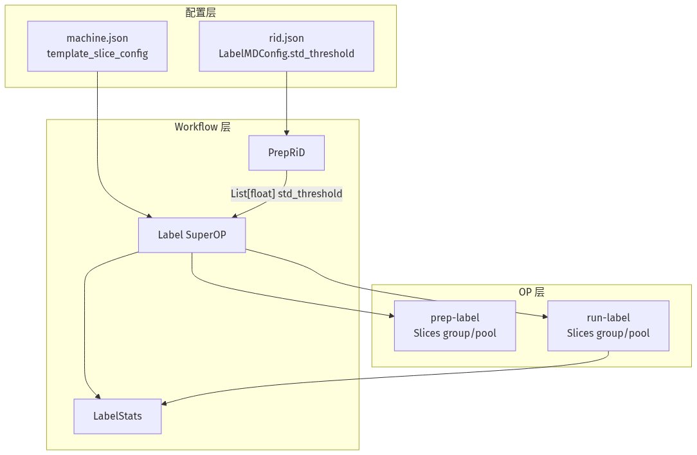
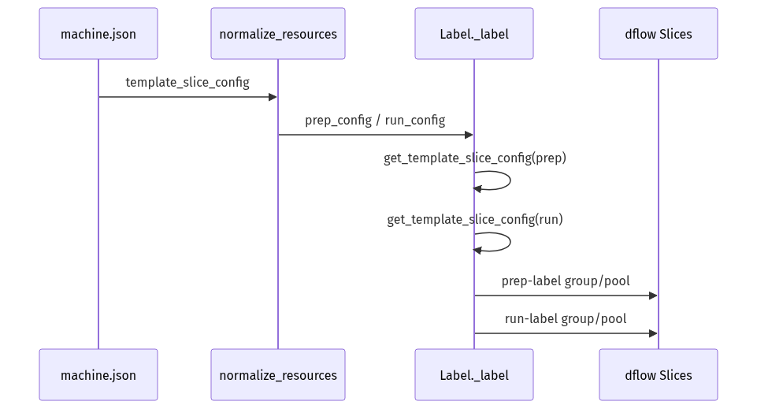
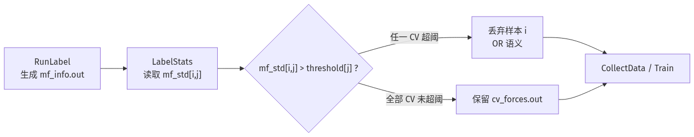

# rid-kit Label 阶段增强 — 设计评审

> **评审范围**：Label slice 调度配置化 + 逐 CV 的 std 阈值筛选  
> **目标仓库**：`deepmodeling/rid-kit`（分支 `qinlang/local`）  
> **评审结论（建议）**：两项改动相互独立、向后兼容，建议分两 PR 合入；需在实际 Bohrium/k8s 环境验证 slice 调度效果。

---

## 1. 背景与问题陈述

### 1.1 Label slice 并行调度

Label 阶段通过 dflow `Slices` + `with_param` 对多个构象并行提交 label 任务。原实现中，`prep-label` 与 `run-label` 在非 merge 路径下硬编码 `group_size=10, pool_size=1`，无法按机器资源调节并发。

**痛点**：

- label 任务数随 selection 增大时，固定打包/并发策略可能导致 pod 调度慢或单 pod 负载过高
- prep（CPU/IO）与 run（MD 重计算）无法分别调参
- 临时分支改 `group_size=6` 缺乏统一配置入口，难以复现与 review

### 1.2 Label std 阈值筛选

`LabelStats` OP 读取各 label 任务的 `mf_info.out`，按 mean force std 过滤未收敛样本。原配置 `std_threshold` 为单一标量，但 `mf_std` 为每个 CV 一个值。

**痛点**（以 `r17-interface/v1` iter3 为例）：6 个 CV 的 std 量级差异明显，例如某样本 std 约为：

```text
[0.33, 0.56, 2.34, 2.22, 0.99, 3.75]
```

单一阈值难以同时适配不同 CV 类型/数量级。

---

## 2. 方案概览



**设计原则**：职责分离（调度放 machine、物理阈值放 rid.json）、向后兼容、prep/run 独立配置。

---

## 3. 方案一：Label slice 调度配置化

### 3.1 配置设计

在 `machine.json` 的 resource 条目新增 `template_slice_config`：

```json
{
  "local_k8s_label": {
    "template_config": { "image": "...rid-gmx-plumed:stable" },
    "template_slice_config": {
      "group_size": 10,
      "pool_size": 2
    }
  }
}
```

| 参数 | 层级 | 含义 |
|------|------|------|
| `group_size` | dflow Slices | 一个执行单元打包多少个 slice 子任务 |
| `pool_size` | dflow Slices | 一个执行单元内同时并发运行多少个 slice |
| `resources_dict.group_size` | DPDispatcher | Slurm/Bohrium job 打包粒度（**不同概念**） |

### 3.2 调用链



### 3.3 拟修改文件

| 文件 | 改动 |
|------|------|
| `rid/utils/set_config.py` | 新增 `get_template_slice_config()` |
| `rid/superop/label.py` | 替换硬编码，prep/run 分别读取 |
| `docs/source/rid_machine.md` | 文档与概念区分 |
| `rid/template/machine_local_k8s.json` | 示例配置 |
| `tests/test_set_config.py` | 单元测试 |

### 3.4 伪代码

```python
def get_template_slice_config(config_dict):
    sc = config_dict.pop("template_slice_config", {}) or {}
    return {
        "group_size": int(sc.get("group_size", 10)),
        "pool_size": int(sc.get("pool_size", 1)),
    }

# label.py
prep_slice = get_template_slice_config(prep_config)
run_slice = get_template_slice_config(run_config)
Slices("{{item}}", group_size=prep_slice["group_size"], pool_size=prep_slice["pool_size"], ...)
```

### 3.5 兼容性

缺省 `template_slice_config` 时行为与现网一致（`10/1`）。不影响 `rid.json`。

---

## 4. 方案二：逐 CV 的 std 阈值

### 4.1 配置设计

```json
"LabelMDConfig": {
  "std_threshold": 5.0
}
```

或：

```json
"std_threshold": [1.5, 1.5, 10.0, 10.0, 2.0, 5.0]
```

| 输入形式 | 行为 |
|----------|------|
| 标量 `float` | 广播到全部 CV |
| 长度 1 的 list | 广播到全部 CV |
| 长度 = `cv_dim` 的 list | 逐 CV index 使用 |
| 其他长度 | `PrepRiD` / standalone label 启动时报错 |

其中 `cv_dim = len(CV.angular_mask)`，应与 `kappas` 长度一致。

### 4.2 筛选语义（保持不变）



### 4.3 拟修改文件

| 文件 | 改动 |
|------|------|
| `rid/utils/set_config.py` | 新增 `normalize_std_threshold()` |
| `rid/op/prep_rid.py` | 解析、广播、校验 |
| `rid/op/label_stats.py` | 按 CV index 比较 |
| `rid/superop/label.py` / `blocks.py` / `flow/loop.py` | 参数类型 `List[float]` |
| `rid/entrypoint/label.py` | 修复 standalone label 未传阈值 |
| `tests/op/test_label_stats.py` | 筛选逻辑单测 |

### 4.4 伪代码

```python
def normalize_std_threshold(threshold, cv_dim):
    if isinstance(threshold, (int, float)):
        return [float(threshold)] * cv_dim
    if len(threshold) == 1:
        return [float(threshold[0])] * cv_dim
    if len(threshold) != cv_dim:
        raise ValueError(...)
    return [float(v) for v in threshold]

# label_stats.py
for i, row in enumerate(mf_all_std):
    for j, num in enumerate(row):
        if num > thresholds[j]:
            discard(i)  # OR 语义：任一 CV 超阈即丢弃整行
```

---

## 5. 风险与开放问题

| 项 | 风险 | 缓解 |
|----|------|------|
| `Workflow.parallelism=50` | 极大 `pool_size` 仍受 workflow 上限约束 | 文档说明；后续可配置化 |
| merge 路径 slice 参数 | 统一传入 group/pool 后行为可能变化 | Bohrium/Slurm 实测 |
| `mf_info` 文本解析 | 格式变化可能导致 silent wrong parse | 长期改结构化输出 |
| 按 CV type 映射阈值 | 当前无 per-CV type 字段 | 首版按 index；type 映射留作 v2 |

---

## 6. 测试与验收

| 测试 | 覆盖点 |
|------|--------|
| `tests/test_set_config.py` | slice 默认值与自定义值 |
| `tests/op/test_label_stats.py` | 标量广播、per-CV 阈值、OR 语义 |
| `tests/op/test_prep_rid.py` | 旧 JSON 回归 |
| `tests/test_label.py`（可选） | dflow 环境端到端 Label SuperOP |

---

## 7. 附录：建议补充的运行实例图表

以下图表可从现有 rid 运行结果生成，用于**支撑评审动机**。

### 7.1 std 阈值动机（强烈推荐）

| 图 | 内容 | 作用 |
|----|------|------|
| **图 A** | 各 CV 的 `mf_std` 直方图（按 CV index 分面或分色） | 展示不同 CV std 量级差异 |
| **图 B** | iter × 保留率曲线（标量 vs per-CV 阈值） | 量化过滤策略差异 |
| **图 C** | heatmap（样本 × CV）：`mf_std[i,j] / threshold[j]` | 标出被 OR 逻辑丢弃的样本 |

**数据来源**：`result/label/iter*/**/mf_info.out`（如 `r17-interface/v1`）

**实例**（`iter3/000_196/mf_info.out`）：

```text
mean force std     0.3322 0.5579 2.3369 2.2246 0.9880 3.7485
```

若统一阈值 `1.5`，该样本会因 CV3/CV4/CV6 超阈被整行丢弃；per-CV 阈值 `[1.5, 2.0, 3.0, 3.0, 2.0, 5.0]` 则可能保留。

### 7.2 slice 调度动机

| 图 | 内容 |
|----|------|
| **图 D** | 单次 label 步构象数（`conf_tags` 长度）vs workflow 完成时间 |
| **图 E** | 不同 `group_size/pool_size` 下 pod 数与 wall time 对比（需 A/B 实验） |

### 7.3 数据质量与训练关联

| 图 | 内容 |
|----|------|
| **图 F** | 过滤前后 `data.raw.npy` 的 CV 分布 |
| **图 G** | 不同阈值策略下 train loss 收敛对比 |

### 7.4 快速生成脚本建议

```python
import glob
import numpy as np
import matplotlib.pyplot as plt

def parse_mf_std(path):
    with open(path) as f:
        for line in f:
            if line.strip().startswith("mean force std"):
                return [float(x) for x in line.strip().split()[3:]]
    return None

paths = glob.glob("result/label/iter3/**/mf_info.out", recursive=True)
rows = [parse_mf_std(p) for p in paths if parse_mf_std(p)]
data = np.array(rows)
cv_dim = data.shape[1]

fig, axes = plt.subplots(1, cv_dim, figsize=(3 * cv_dim, 3))
for j in range(cv_dim):
    axes[j].hist(data[:, j], bins=30)
    axes[j].set_title(f"CV{j+1} mf_std")
plt.savefig("mf_std_by_cv.png", dpi=150)
```

**建议优先级**：图 A + 图 C > 图 B > 图 D/E（slice 动机需实验数据）。

### 7.5 已生成示例图（r17-interface v1, iter3）

基于 `r17-interface/v1/result/label/iter3/**/mf_info.out` 已生成以下图表，路径：`docs/figures/`。

| 文件 | 说明 |
|------|------|
| `fig_a_mf_std_hist_by_cv_iter3.png` | 图 A：iter3 各 CV 的 mean force / mf_std 分布（上下两行） |
| `fig_force_std_magnitude_iter3.png` | iter3 各 CV 力与 std 量级对比（median / p90） |
| `fig_b_retention_vs_threshold.png` | 图 B：iter3 标量阈值扫描 vs 当前阈值 / per-CV p90 |
| `fig_c_heatmap_iter3_scalar_10.png` | 图 C：iter3，标量阈值 10.0（y 轴为样本序号） |
| `fig_c_heatmap_iter3_per_cv.png` | 图 C：iter3，per-CV p90 阈值 |
| `figure_summary.txt` | iter3 保留率与 median 摘要 |

复现命令：

```bash
python docs/plot_label_std_figures.py --focus-iter iter3
```

当前配置 `std_threshold=10.0` 下 iter3 保留率 **87.5%**。若改用 iter3 各 CV 的 p90 作为 per-CV 阈值，保留率约为 **60.0%**。

---

## 8. 合入建议

建议拆成两个独立 PR：

1. `feat: configurable label slice scheduling`
2. `feat: per-CV std_threshold for label filtering`
